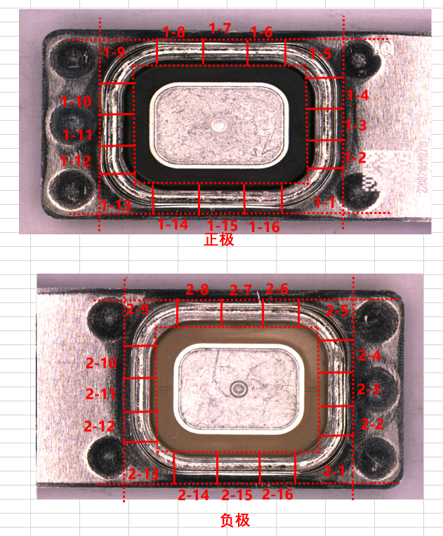
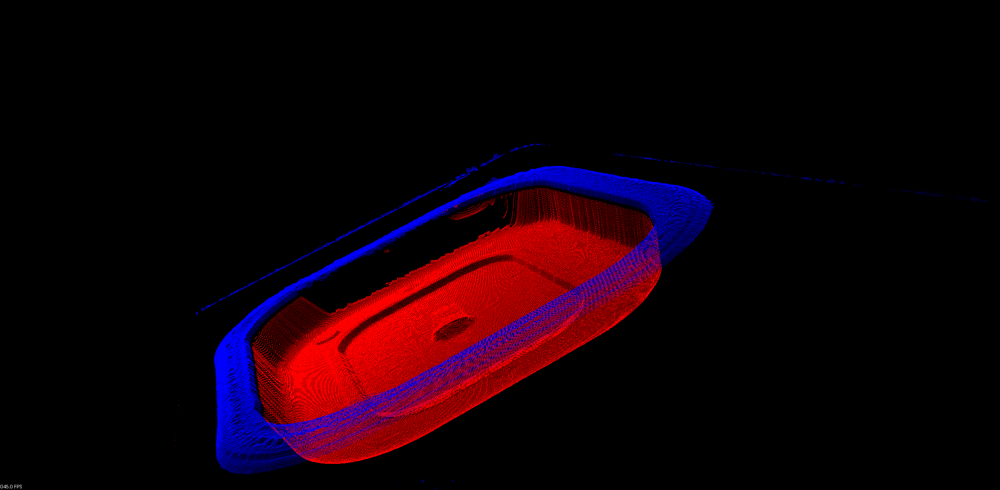
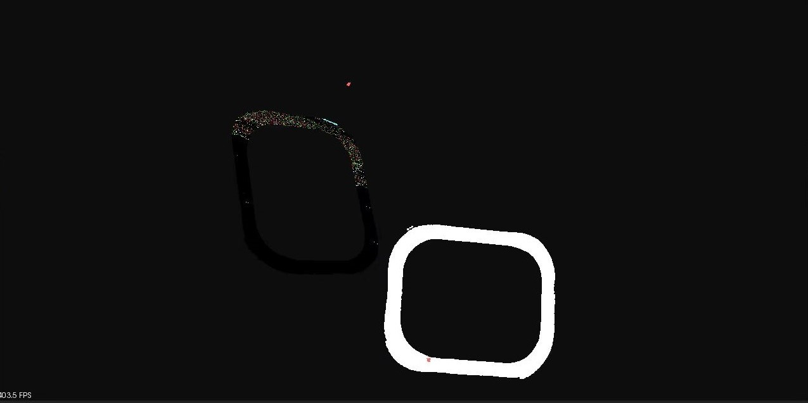
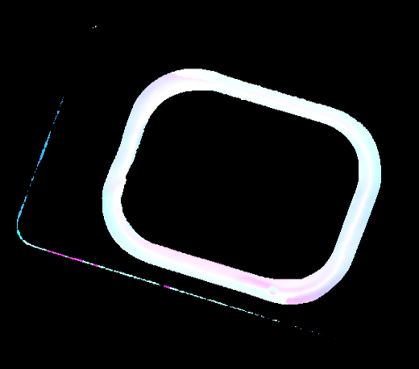

本算法用新能源汽车电池缺陷检测做测试

瑕疵都在焊道上，分断焊 焊洞 焊高 焊渣 虚焊五种缺陷类型。

所以无论什么算法，都是匹配焊道点云，其他部分需要过滤掉。

# 传统算法3D模板匹配（已弃用算法，做对比）

## 思路

点云分割->降采样->计算特征云->特征匹配（ps：这个需要做个流程图）

点云分割：由于点云中有一个非常明显的平面，先找到这个平面，然后比较每个点在平面的上方还是下方，如下图所示：

蓝色部分为焊道点云，是我们所需要的点，红色部分为电池正负极，不需要参与后续处理。

降采样：采用体素网格滤波

计算特征云：计算每个点的法向量方向，映射成特征云。

特征匹配：根据最远相应距离计算匹配分数

匹配结果如下图：

## 缺点

运行时间慢（3-5min），准确率低（40%-50%），工业上完全不可用

# 3D点云深度学习（已弃用算法，用作对比）

原本打算用这个方法，查的论文也是这个方法，PointNet，VoteNet等一系列网络。（ps：网上找这两个模型的结构图）

## 优点

较为成熟稳定。

## 缺点

1. 这些开源的网络框架都是面向激光雷达扫描出的点云图做的。本课题中的数据是线激光扫描仪扫出来的，缺少intensity（反射强度）、RGB颜色信息，与开源框架及任何开源数据集的格式都不同，网上也找不到用只含xyz的信息点云做缺陷检测的思路分享、代码参考。时间允许的话，后续我可以再试试大改一下，把dataset、loss、model都改了（和重写没啥区别）。

2. 训练时间较长，动辄3-5天，推理速度也不算出众。

为此，我尝试自建网络，重新设计一个推理速度快、满足工业需求的网络。

# 基于自注意力机制深度学习的点云特征提取算法

## 模型框架

（depth+ normal vector）->resnet34-> Attention(ps：网上找一下完整的resnet34模型框架图，在那个基础上加个自注意力模块，做一个完整的流程图)

## 创新点

第一个创新点是这个自注意力模块

第二个创新点是把点云映射成4个特征维度，第一个维度是点云的深度，后三个维度是对应点的法向量，如下图是四通道图的可视化表示：

第三个优点吧，不算创新点了：没有使用随机梯度下降算法，使用的是Adam优化器。

模型在部分数据集训练的模型上测试集准确率可达85.714%（ps：后续补上loss曲线图）

## 消融实验：

去掉注意力机制，准确率变为71%（ps：后续补上loss曲线图）

去掉后三个维度法向量，只保留深度（也就是纯深度图），准确率变成28.571%（ps：后续补上loss曲线图）

## 原理推测：

1. 纯深度图的信息有一定丢失，卷积虽然也算是关联相邻点的一种方法（共享权值），但是没有法向量直接，直接用法向量作为特征输入，效果更好。

2. 在点云转化成特征图时，有类似池化的操作（判断depth_image.at<cv::Vec4f>(u, v)[0] < depth_value），这实际上就类似PointNet中的最大池化思想，多个点映射成一个点，取最大，可以有效对抗点云的无序性。
3. 自注意力机制使点云更多关注对分类结果影响大的通道（可能是法向量）。